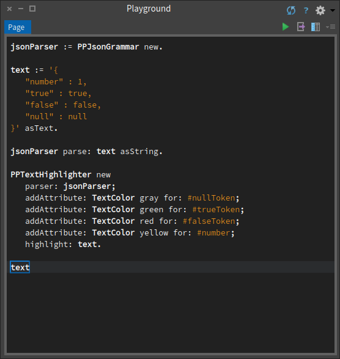

# PetitParser [](https://travis-ci.org/moosetechnology/PetitParser)
Petit Parser is a framework for building parsers.

The version of PetitParser on this repository is supported by Pharo 6.1 and Pharo 7. To use it with older Pharo version, please refer to the [Smalltalkhub repository](http://smalltalkhub.com/#!/~Moose/PetitParser).

- [About Petit Parser](#about-petit-parser)
  * [Cool feature 1: Easily write an expression parser](#cool-feature-1-easily-write-an-expression-parser)
  * [Cool feature 2: Create a cheap highlighter from your grammar](#cool-feature-2-create-a-cheap-highlighter-from-your-grammar)
- [Install](#install)
  * [Groups](#groups)
- [Version management](#version-management)
- [Grammars provided](#grammars-provided)
- [Packages removed during/after migration](#packages-removed-duringafter-migration)

## About Petit Parser
Petit Parser is a framework for building parsers. It was originally developed by Lukas Renggli.

Basic information about PetitParser can be found here:

- [Writing Parsers with PetitParser](http://www.lukas-renggli.ch/blog/petitparser-1)
- [Composite Grammars with PetitParser](http://www.lukas-renggli.ch/blog/petitparser-2)
- [Petit Parser in Deep into Pharo Book](http://pharobooks.gforge.inria.fr/PharoByExampleTwo-Eng/latest/PetitParser.pdf)

This repository is a port from the [Smalltalkhub repository](http://smalltalkhub.com/#!/~Moose/PetitParser). However, further contributions to this project should take place on this Github repository.

### Cool feature 1: Easily write an expression parser

> Note: this section is based on the comment of PPExpressionParser class.

The following code initializes a parser for arithmetic expressions. First we instantiate an expression parser, a simple parser for expressions in parenthesis and a simple parser for integer numbers.
```Smalltalk
expression := PPExpressionParser new.
parens := $( asParser trim , expression , $) asParser trim 
	==> [ :nodes | nodes second ].
integer := #digit asParser plus trim
	==> [ :token | Integer readFrom: token readStream ].
```

Then we define on what term the expression grammar is built on:
```Smalltalk
expression term: parens / integer.
```
Finally we define the operator-groups in descending precedence. Note, that the action blocks receive both, the terms and the parsed operator in the order they appear in the parsed input. 
```Smalltalk
expression
	group: [ :g |
		g prefix: $- asParser trim do: [ :op :a | a negated ] ];
	group: [ :g |
		g postfix: '++' asParser trim do: [ :a :op | a + 1 ].
		g postfix: '--' asParser trim do: [ :a :op | a - 1 ] ];
	group: [ :g |
		g right: $^ asParser trim do: [ :a :op :b | a raisedTo: b ] ];
	group: [ :g |
		g left: $* asParser trim do: [ :a :op :b | a * b ].
		g left: $/ asParser trim do: [ :a :op :b | a / b ] ];
	group: [ :g |
		g left: $+ asParser trim do: [ :a :op :b | a + b ].
		g left: $- asParser trim do: [ :a :op :b | a - b ] ].
```
After evaluating the above code the `expression` is an efficient parser that evaluates examples like:

```Smalltalk	
expression parse: '-8++'.
expression parse: '1+2*3'.
expression parse: '1*2+3'.
expression parse: '(1+2)*3'.
expression parse: '8/4/2'.
expression parse: '8/(4/2)'.
expression parse: '2^2^3'.
expression parse: '(2^2)^3'.
```

### Cool feature 2: Create a cheap highlighter from your grammar
`PPTextHighlighter` allows you to create a cheap syntax highlighter from your grammar.
Consider the following example from a JSON grammar. We want:
- `null` to appear gray;
- `true` to appear green;
- `false` to appear red; and
- any number to appear yellow.

```
jsonParser := PPJsonGrammar new.

text := '{
	"number" : 1,
	"true" : true,
	"false" : false,
	"null" : null
}' asText.

jsonParser parse: text asString.

PPTextHighlighter new
	parser: jsonParser;
	addAttribute: TextColor gray for: #nullToken;
	addAttribute: TextColor green for: #trueToken;
	addAttribute: TextColor red for: #falseToken;
	addAttribute: TextColor yellow for: #number;
	highlight: text. "Here we tell the highlighter to higlight text. This modifies the Text object."
	
text inspect
```

Result:



> Note: PPTextHighlighter is available in 'Highlighter' group of the baseline.

## Install
```
Metacello new
   baseline: 'PetitParser';
   repository: 'github://moosetechnology/PetitParser/src';
   load.
```

### Groups
It is possible to load subpart(s) of this project using groups:
- `Minimal`: Kernel of the framework.
- `Core`: Kernel of the framework and extensions to SUnit to make parsers testing easier.
- `Tests`: Tests of PetitParser's core.
- `Examples`: Simple examples of grammars.
- `Islands`: Utilities to define island grammars.
- `Analyzer`: Various tools to do code analysis / code rewriting.
- `Indent`: Utilities to define grammar for language based on indentation (e.g. Python, YAML, etc.)
- `Preprocessor`: Utilities to apply pre-processing on a parser input in a handy way.
- `Extension`: Provides `PPExtendedCompositeParser` which allows one to define parsers for which rules do not rely on instance variables (allow to exceed the limit of 256 rules per parser) and `PPMultiStringParser` which allows to build efficient parsers for huge list of strings.
- `TestsExtension`: Adds some useful methods to `PPCompositeParserTest`.
- `Highlighter`: Utility to create cheap highlighter for Text object from a grammar.
- `GT`: Extension to the inspector allowing to debug grammar more easily.
- `SmalltalkCore`: Smalltalk parser.
- `Smalltalk`: Smalltalk parser and its tests.
- `RegexCore`: Regex parser.
- `Regex`: Regex parser and its tests.
- `YAMLCore`: YAML parser.
- `YAML`: YAML parser and its tests.
- `ParserCore`: A collection of various grammars.
- `Parser`: A collection of various grammars and their tests.
- `ParserIDE`: Graphical tools to develop and debug parsers.

By default, if no group is specified, `Core`, `Tests`, `Examples`, `Islands`, `Analyzer`, `GT` and `Parser` groups are loaded.


## Version management

This project use semantic versionning to define the releases. This mean that each stable release of the project will get associate a version number of the form `vX.Y.Z`.

- **X** define the major version number
- **Y** define the minor version number
- **Z** define the patch version number

When a release contains only bug fixes, the patch number increase. When the release contains new features backward compatibles, the minor version increase. When the release contains breaking changes, the major version increase.

Thus, it should be safe to depend on a fixed major version and moving minor version of this project.

The first release on this Github repository matches with the last release that happened on Smalltalkhub (v1.9.2).

## Grammars provided
11 grammars are provided by this project. One can load them all using `Parser` group.

- Factorial-Language
- PetitCSV
- PetitIndent
- PetitJson
- PetitMSE
- PetitManifestMf
- PetitRegex
- PetitSmalltalk
- PetitXPath
- PetitXml
- PetitYAML

## Packages removed during/after migration
Some package were not migrable, thus they stayed on smalltalkhub. If you find a way to migrate them, please propose a PR:
- ConfigurationOfSqlEvaluator
- GT-InspectorExtensions-Pillar
- PetitBeta
- PetitSQL
- SQL-Evaluator
- SQL-Evaluator-GemStone
- SQL-Evaluator-Pharo

Because its unit tests were all broken, the Java island grammar has been removed.
The last time it was available in this repository is at commit [37074366fb6587dd8554cc4cd9a8621dfa5487bd](https://github.com/moosetechnology/PetitParser/commit/37074366fb6587dd8554cc4cd9a8621dfa5487bd). Feel free to load the version of this repository pointed by this commit to reanimate this island grammar if you want. In such case, a PPR is welcome.
